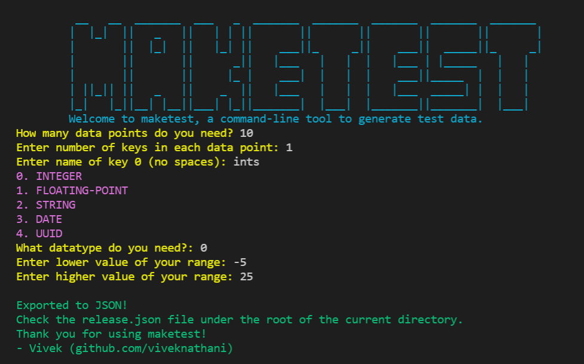

# maketest

[](https://github.com/viveknathani/maketest/actions/workflows/test.yaml) [](https://goreportcard.com/report/github.com/viveknathani/maketest) [](https://codeclimate.com/github/viveknathani/maketest/maintainability) 



## build

Code is written in Go `v1.17`.
After getting that, run, 
```bash
    go build 
``` 

## releases

If you are looking for just the binary, you can find it in the [releases](https://github.com/viveknathani/maketest/releases) section.

## contributing 

If you are interested in working on this project, check out the [contributing guidelines](./CONTRIBUTING.md).

## license

[MIT](./LICENSE.md)