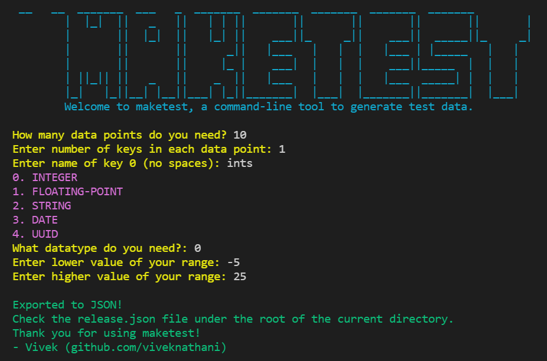

# maketest



## build

Code is written in Go `v1.16`.
After getting that, run, 
```bash
    go build 
``` 

## contributing 

If you are interested in working on this project, check out the [contributing guidelines](./CONTRIBUTING.md)

## license

[MIT](./LICENSE.md)